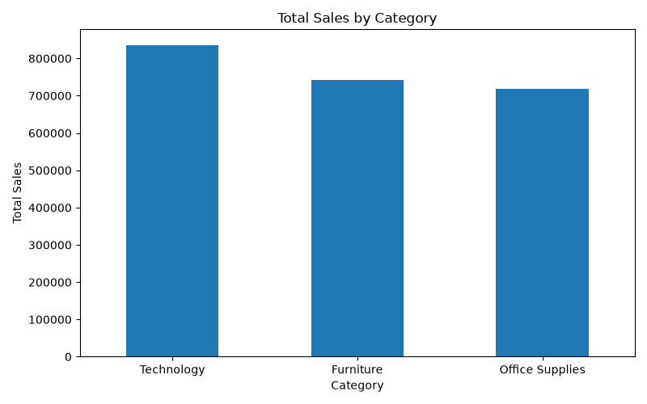
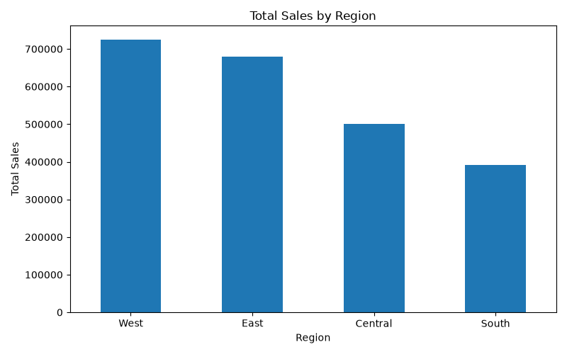
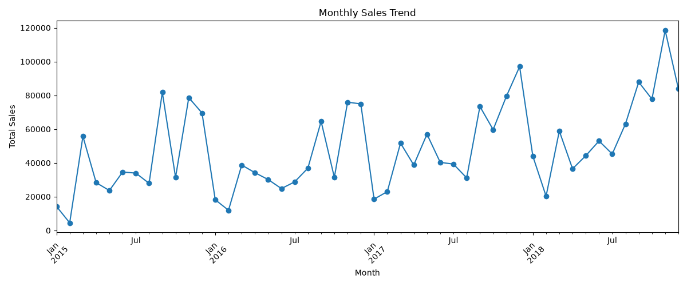
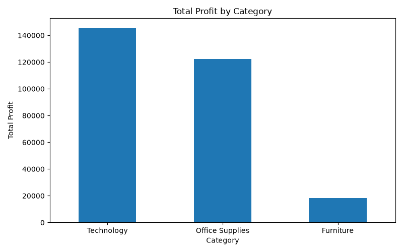
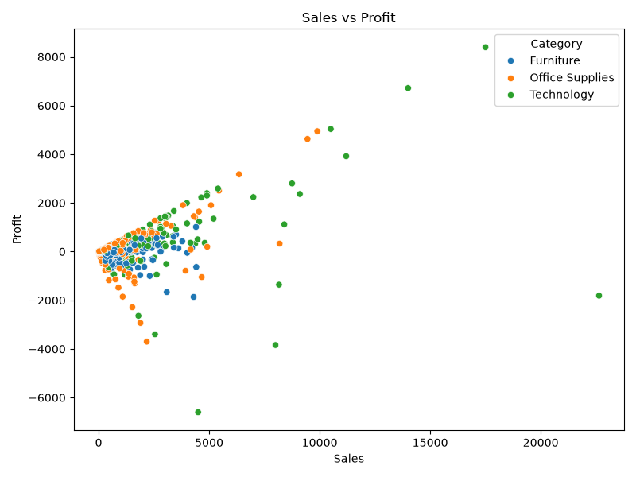
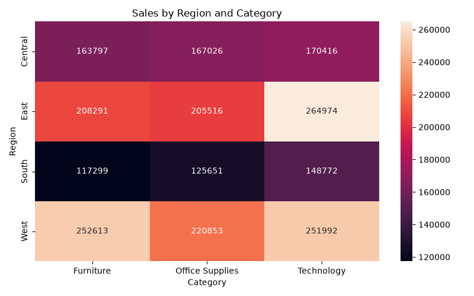

# Sales Data Analysis & Visualization

## Project Overview

This project analyzes the Superstore sales dataset using Python and
creates visualizations to identify sales trends, category performance,
regional performance, and profitability.

## Objectives

- Analyze sales data
- Compare sales across categories
- Compare sales across regions
- Analyze monthly sales trends
- Compare profit across categories
- Analyze the relationship between sales and profit
- Identify sales patterns across regions and categories

## Technologies Used

- Python
- Pandas
- Matplotlib
- Seaborn
- GitHub

## Dataset

The project uses the Superstore sales dataset.

The dataset contains information about orders, customers, products,
sales, quantity, discounts, profit, regions, and categories.

## Visualizations

### 1. Sales by Category



### 2. Sales by Region



### 3. Monthly Sales Trend



### 4. Profit by Category



### 5. Sales vs Profit



### 6. Sales by Region and Category



## Key Insights

The visualizations help identify:

- Which categories generate the highest sales.
- Which regions perform best.
- How sales change over time.
- Which categories generate the highest profit.
- The relationship between sales and profit.
- Which category-region combinations perform strongly.

## Conclusion

This project demonstrates how Python-based data analysis and
visualization can be used to understand sales performance and
identify useful business insights.

## How to Run

Install the required libraries:

```bash
pip install -r requirements.txt